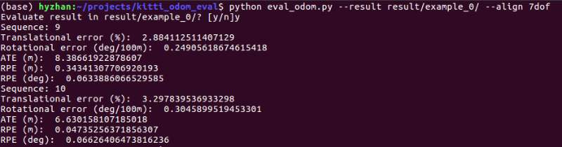
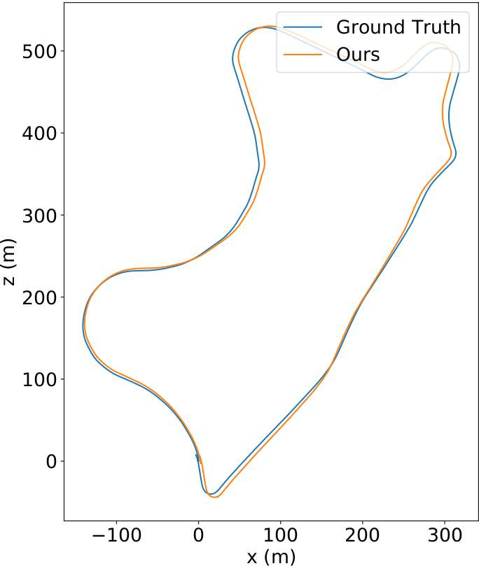
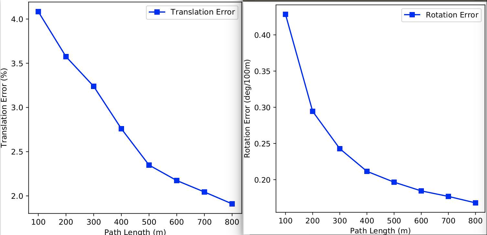
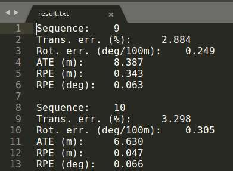

## Introduction 

This code is based on the [kitti odometry evaltion toolbox](https://github.com/Huangying-Zhan/kitti-odom-eval). The difference is that it could accept another kind of result format as input. Of course, the previous result format is accepted.

## Requirement
We recommend using [Anaconda](https://www.anaconda.com/distribution/) for installing the prerequisites.

```
conda create -n py310 python=3.10.12
conda activate py310  # activate the environment
pip install matplotlib numpy glob2
```

## Result Format
Before evaluation, estimated poses should be saved in a `result/*.txt` file. 
Currently, there are two formats are supported.

Suppose the pose for 100-th image is 
```
T00 T01 T02 T03
T10 T11 T12 T13
T20 T21 T22 T23
0   0   0   1
```
You should save the pose as
```
# First format: skipping frames are allowed
99 T00 T01 T02 T03 T10 T11 T12 T13 T20 T21 T22 T23 

# Second format: all poses should be included in the file
T00 T01 T02 T03 T10 T11 T12 T13 T20 T21 T22 T23
```
The newly accepted format should be saved in a `source/*.txt` file, which is generated by [A-LOAM-devl](https://github.com/HKUST-Aerial-RObotics/A-LOAM).

## Usage
You can use this tool by running any of the following code. 

```
python eval_odom.py --result result/test --source source/test --align 7dof 
python eval_odom.py --result result/test --align 7dof 
python eval_odom.py --result result/test --source source/test --align 7dof --seqs 0
python eval_odom.py --result result/test --align 7dof --seqs 0
```
if the `--source` is applied, it will use `rouce/*.txt` as input and generate results.

`X` is the sequence number. If `--seqs` is not given, all available sequences in the folder will be evaluated.

The detailed results will be saved in `RESULT_PATH`

## Alignment
Following prior works, certain degrees of alignment can be done in this evaluation script. Pass one of the following argument `--align XXX` to the script, where `XXX` can be,
* scale
* scale_7dof
* 6dof
* 7dof

### scale
Find a scaling factor that best align the predictions to the ground truth (GT) poses

### scale_7dof
Find a 6+1 DoF transformation, including translation, rotation, and scaling, that best align the predictions to the GT poses.
After that, only the scaling factor is used to align the predictions to the GT for evaluation.

### 6dof
Find a 6 DoF transformation, including translation and rotation that best align the predictions to GT poses.

### 7dof
Find a 6+1 DoF transformation, including translation, rotation, and scaling, that best align the predictions to the GT poses.

## Evaluation result
Here shows some evaluation result examples


Trajectory comparison



Sub-sequence error



Result summary



## License

The code is based on [kitti odometry evaltion toolbox](https://github.com/Huangying-Zhan/kitti-odom-eval). 


The code is released under the permissive MIT license.

```
@article{zhan2019dfvo,
  title={Visual Odometry Revisited: What Should Be Learnt?},
  author={Zhan, Huangying and Weerasekera, Chamara Saroj and Bian, Jiawang and Reid, Ian},
  journal={arXiv preprint arXiv:1909.09803},
  year={2019}
}
```
